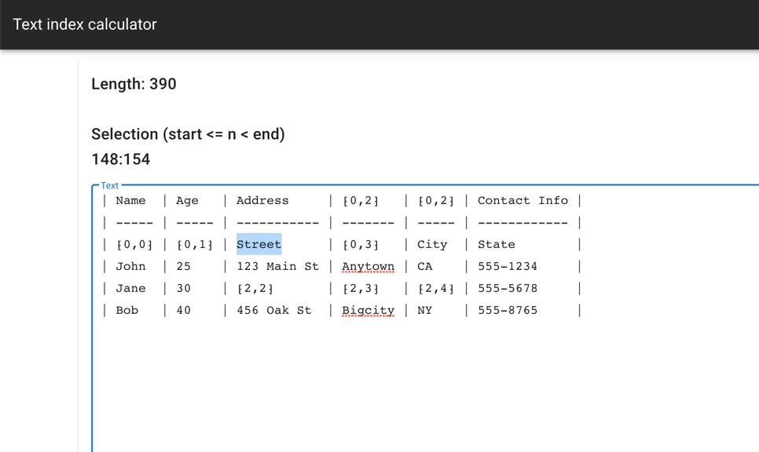

# Text index counter

I couldn't find a good tool online, so I made one.

When you enter text, it displays text length and position values.

## Check out this link. 

https://text-index-counter.web.app/

